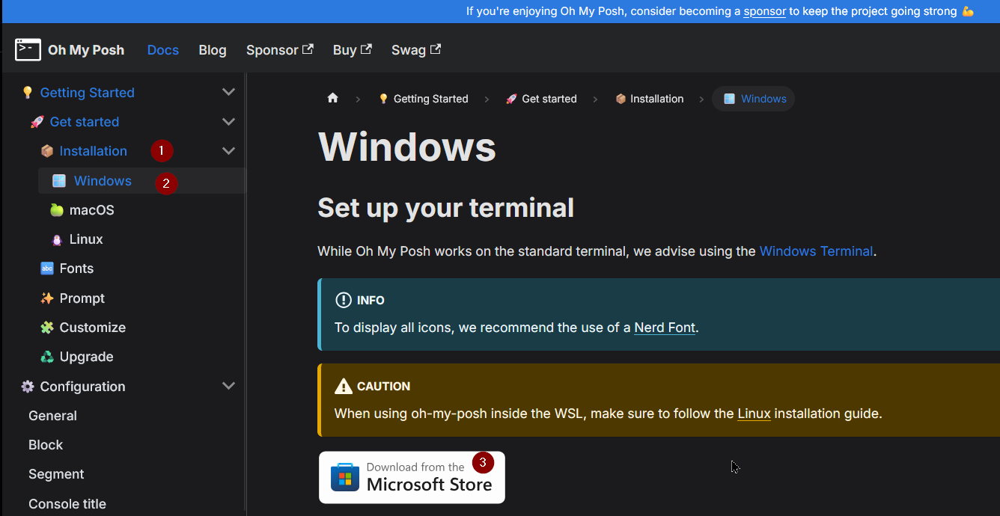

# WindowsTerminal and Oh My Posh for Windows 11

Lets make your wt nice and cool

1) Install [Windows Terminal](https://learn.microsoft.com/en-us/windows/terminal/install)

2) Get [Oh my posh](https://ohmyposh.dev/)
 * Click on Get Started
 * Select windows > install via Manual or via Microsoft Store:

   


[Download any THEME fom Oh My Posh web:](https://ohmyposh.dev/docs/themes)

3) Open a PowerShell and type:
 ```bash
 notepad $PROFILE
 ```
If you get an error you can clean the profile like this:
```
New-Item -Path $PROFILE -Type File -Force
```
If no errors then 2 options.

- A path to a local configuration file:
```
--config 'C:/Users/Posh/jandedobbeleer.omp.json'
```
- A URL pointing to a remote config:

```
--config 'https://raw.githubusercontent.com/JanDeDobbeleer/oh-my-posh/main/themes/jandedobbeleer.omp.json'
```
At the end your $PROFILE will look like:
```
oh-my-posh init pwsh --config "C:\Users\aguacate\Downloads\agnoster.omp.json" | Invoke-Expression
```
- Save and execute:
```
. $PROFILE
```
*Some warinings and errors will shown, just keep going*

> and see the magic !

4) All nice but no icons !!!, let's install them !


5) On the same PS session execute:
```sh
 oh-my-posh font install
```
And search for: **IBMPlexMono**


Once installed, on the same PS windows open setings:


In Startup change **Default terminal application** and select Windows Terminal **Click Save buton**


Now click on: **Open JSON file**


And add **ONLY** the code starting with **font** in Profiles -> defaults:

```
  "profiles": 
    {
        "defaults": 
        {
            "colorScheme": 
            {
                "light": "Campbell"
            },
            "font": 
            {
                "face": "BlexMono Nerd Font"
            }
        },
        "list": 
```

So only add this:
```
            ,
            "font": 
            {
                "face": "BlexMono Nerd Font"
            }
```
Save the file and click on Defaults


Then click on: **Apperance**, then change **Color scheme** for *Cambell* or some other then change **Font face** and type: *BlexMono Nerd Font* and click **Save**


Open a new tab in the "+" sing and you will see you new powershell like this one:


> Some fonts don't works some other yes but you can play :)

* [Themes](https://ohmyposh.dev/docs/themes)
* [Fonts](https://ohmyposh.dev/docs/installation/fonts)
* [GitRepo](https://github.com/jandedobbeleer/oh-my-posh)

